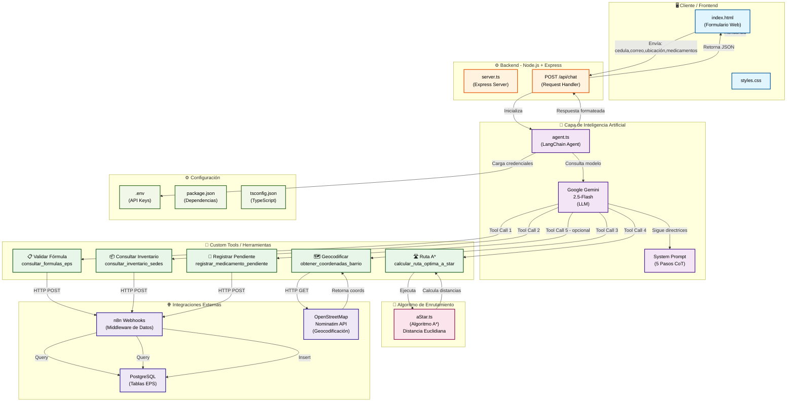
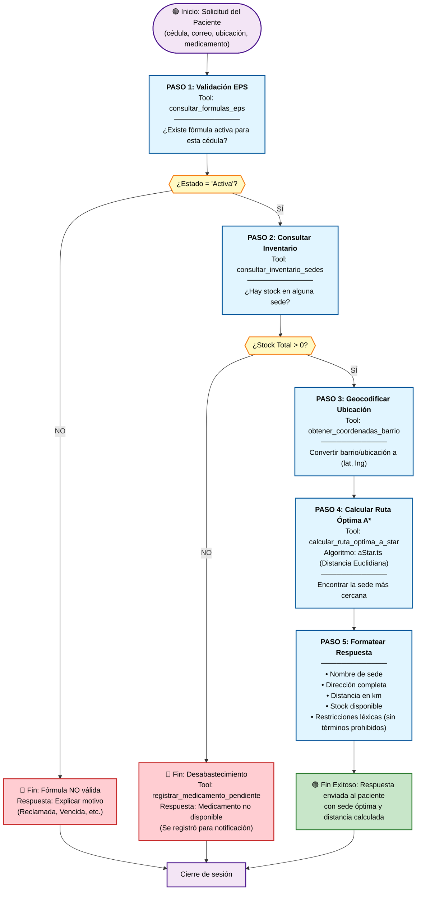
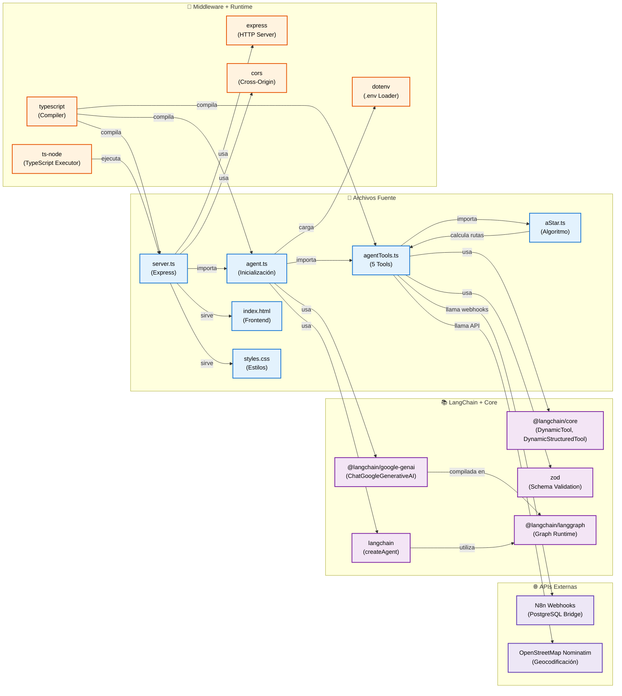

# Sistema Inteligente de Disponibilidad y Enrutamiento de Medicamentos — Nivel 2 (LangChain + LangGraph)

Backend cognitivo transaccional que integra inteligencia artificial con orquestación de herramientas deterministas para validar fórmulas médicas, consultar inventario en sedes, geocodificar ubicaciones mediante OpenStreetMap y ejecutar enrutamiento algorítmico A*, optimizando el acceso de los pacientes a sus medicamentos.

El sistema opera bajo una arquitectura de agente único sin memoria persistente: cada invocación es un disparo independiente que recorre un grafo ReAct cíclico, donde el modelo de lenguaje gobierna la selección dinámica de herramientas mientras el flujo de decisión está rígidamente acotado por un system prompt de cinco pasos.

---

## Diagrama de Arquitectura



### Descripción del Diagrama de Arquitectura

**Flujo de datos:**

1. **Frontend → Backend:** El usuario completa el formulario web (cédula, correo, ubicación, medicamentos) y envía una solicitud POST a `/api/chat`.

2. **Backend → Agente IA:** El servidor Express inicializa la instancia del agente LangChain, cargas las credenciales desde `.env` y carga el `SystemPrompt` con las directrices de cinco pasos.

3. **Agente ↔ LLM:** El agente delega la decisión al modelo Gemini, que evalúa el contexto y determina qué herramienta invocar según el paso del flujo.

4. **Herramientas → Datos:**
   - **T1, T2, T5** conectan con n8n (middleware), que a su vez consulta PostgreSQL.
   - **T3** se comunica directamente con la API pública de OpenStreetMap (Nominatim).
   - **T4** ejecuta el algoritmo A* localmente en `aStar.ts` sin hacer llamadas externas.

5. **Respuesta → Frontend:** El agente formatea la respuesta según restricciones léxicas y la retorna al cliente como JSON, que se renderiza en la interfaz web.

---

## Arquitectura Cognitiva y Componentes

### 1. Modelo de Lenguaje (LLM)

| Propiedad          | Valor               | Justificación Técnica                                                       |
|--------------------|---------------------|-----------------------------------------------------------------------------|
| Proveedor          | Google Gemini       | Sustituye a Groq tras superar rate limits (429) por alto volumen de tokens  |
| Modelo             | `gemini-2.5-flash`  | Balance óptimo entre latencia, costo y capacidad de razonamiento            |
| Temperatura        | `0.2`               | Minimiza la creatividad léxica; maximiza el determinismo y la repetibilidad |
| `maxRetries`       | `2`                 | Tolerancia a fallos transitorios de red sin exponer errores al cliente      |
| SDK                | `@langchain/google-genai` | Integración nativa con la interfaz `ChatModel` de LangChain          |

Instanciación real en `agent.ts:16–34`:

```typescript
const model = new ChatGoogleGenerativeAI({
    model: "gemini-2.5-flash",
    temperature: 0.2,
    apiKey: apiKey,
    maxRetries: 2,
});
```

### 2. Ingeniería de Prompts — System Prompt

El `systemPrompt` implementa una estrategia de **Chain-of-Thought (CoT) estructurada y determinista**: un algoritmo de cinco pasos codificado explícitamente que el modelo debe ejecutar secuencialmente sin omitir ninguno.

**Estructura del prompt (`agent.ts:38–130`):**

| Paso | Responsabilidad                                        | Herramienta involucrada            | Bifurcación condicional                          |
|------|--------------------------------------------------------|------------------------------------|--------------------------------------------------|
| 1    | Validación de fórmula médica vía cédula y correo       | `consultar_formulas_eps`           | Si no es `Activa` → termina la atención          |
| 2    | Consulta de inventario por medicamento                 | `consultar_inventario_sedes`       | Si stock total = 0 → `registrar_medicamento_pendiente` y termina |
| 3    | Geocodificación de ubicación del paciente              | `obtener_coordenadas_barrio`       | Fallback a coordenadas del centro de Manizales  |
| 4    | Enrutamiento inteligente con algoritmo A*              | `calcular_ruta_optima_a_star`      | Opera sobre el subconjunto filtrado de sedes    |
| 5    | Formateo de respuesta con restricciones léxicas        | — (solo generación de texto)       | Prohibición de tecnicismos y cierre en seco     |

**Regla de Oro — Cero Alucinaciones:** El prompt prohíbe explícitamente al modelo inventar nombres de sedes, direcciones, cantidades de inventario o coordenadas. Toda afirmación debe estar respaldada exclusivamente por los datos retornados por las herramientas.

**Prohibiciones léxicas en la respuesta:** Los términos `algoritmo`, `A*`, `A Star`, `LangChain`, `herramienta`, `tool`, `función`, `parámetro`, `JSON` y `API` están prohibidos en la salida hacia el paciente. Se emplean sustitutos como *sistema de enrutamiento*, *optimización de ubicación* o *análisis de cercanía*.

### 3. Catálogo de Custom Tools

Cinco herramientas personalizadas registradas en el arreglo `tools` (`agent.ts:36`), cada una encapsulada como `DynamicTool` o `DynamicStructuredTool` de LangChain:

| Tool (variable)                | `name` (semántico LLM)        | Propósito                                                                 | Conexión externa                          |
|--------------------------------|-------------------------------|---------------------------------------------------------------------------|-------------------------------------------|
| `toolConsultarFormulas`        | `consultar_formulas_eps`      | Valida la existencia y estado de una fórmula médica por cédula            | Webhook n8n → tabla `autorizaciones_eps`  |
| `toolConsultarInventario`      | `consultar_inventario_sedes`  | Consulta stock de un medicamento en todas las sedes                       | Webhook n8n → inventario por sede         |
| `toolCalcularRutaOptima`       | `calcular_ruta_optima_a_star` | Ejecuta A* con distancia euclidiana para hallar la sede más cercana       | Módulo local `aStar.ts` (sin fetch)       |
| `toolObtenerCoordenadasBarrio` | `obtener_coordenadas_barrio`  | Geocodifica texto de ubicación a coordenadas (lat, lng) vía Nominatim/OSM | API pública OpenStreetMap (Nominatim)     |
| `toolRegistrarMedicamentoPendiente` | `registrar_medicamento_pendiente` | Inserta un registro de desabastecimiento en la tabla de pendientes   | Webhook n8n → tabla `pendientes_eps`      |

Las herramientas estructuradas (`DynamicStructuredTool`) utilizan esquemas **Zod** para validar que el LLM genere los parámetros con el tipo correcto antes de cada invocación, eliminando errores de serialización en tiempo de ejecución.

### 4. Arquitectura del Agente

```typescript
export const inicializarAgente = async (): Promise<any> => {
    const modeloInicializado = obtenerModelo();
    const agent = createAgent({
        model: modeloInicializado,
        tools: tools,
        systemPrompt: systemPrompt,
    });
    return agent;
};
```

La función `createAgent` del paquete `langchain` (API moderna que reemplaza al deprecado `createReactAgent` de `@langchain/langgraph/prebuilt`) compila internamente un **grafo cíclico de estados** sobre la infraestructura de LangGraph, gobernado por el bucle cognitivo **ReAct (Reason → Act → Observe → Repeat)**:

1. **Nodo Agent:** Ejecuta el LLM. Si la salida contiene una *tool call*, el grafo transiciona al nodo Tools. Si no, el estado se marca como terminal y se retorna la respuesta.
2. **Nodo Tools:** Resuelve cada *tool call* invocando la función asociada y retorna la observación al grafo, que vuelve al nodo Agent para la siguiente iteración.
3. **Ciclo:** Se repite hasta que el LLM produce una respuesta final sin *tool calls* pendientes, momento en el cual el grafo alcanza un estado terminal y `invoke()` resuelve la promesa.

No se emplea `checkpointer` ni memoria persistente: el agente es **transaccional** (cada invocación es atómica e independiente), lo que elimina la necesidad de gestionar sesiones o buffers de historial entre requests.

---

## Cadena de Pensamiento, Logs y Justificación de RAG

### Estrategia CoT — Bifurcaciones Condicionales

El system prompt fuerza al modelo a recorrer los cinco pasos secuencialmente, pero introduce dos bifurcaciones condicionales que alteran la trayectoria del grafo:

1. **Paso 1 → Terminación temprana:** Si la fórmula no está activa (`estado !== 'Activa'`), el modelo debe explicar la razón y detenerse. No se consulta inventario ni se ejecuta enrutamiento.
2. **Paso 2 → Bifurcación crítica:**
   - **Ruta A (stock > 0 en al menos una sede):** Se filtran las sedes con existencias, se geocodifica la ubicación (paso 3), se ejecuta A* (paso 4) y se formatea la respuesta con la sede óptima y su distancia (paso 5).
   - **Ruta B (stock = 0 en todas las sedes):** Se invoca `registrar_medicamento_pendiente` con cedula, correo y medicamento; se informa al paciente del desabastecimiento total y se termina sin pasar por geocodificación ni enrutamiento.

Además, el prompt incluye una **regla de corrección semántica** en el paso 2: si el paciente menciona un nombre comercial (p. ej., *Dolex*, *Geniol*), el modelo debe traducirlo a su principio activo (*Acetaminofén*, *Paracetamol*) antes de invocar la herramienta de inventario, y reintentar si la primera llamada devuelve vacío.

### Diagrama de Flujo — 5 Pasos CoT con Bifurcaciones



---

### Estrategia de Persistencia, Memoria y Justificación de RAG

| Concepto | Implementación en el Sistema | Justificación Arquitectónica |
| :--- | :--- | :--- |
| **¿Aplica RAG Tradicional?** | ❌ **No Aplica** (No usa Vector Stores ni Embeddings) | Los datos de una EPS (fórmulas médicas, stock físico) son altamente volátiles y requieren precisión numérica exacta. Los modelos de embeddings tradicionales y las bases de datos vectoriales operan por *similitud semántica*, lo que introduce un riesgo inaceptable de "falsos positivos" (por ejemplo, confundir stock 0 con stock 1 debido a distancias vectoriales cercanas). |
| **¿Estrategia de Retrieval?** | 🚀 **Sí, Retrieval Estructurado Dinámico (Function-Calling)** | Aunque no se procesan archivos no estructurados (PDF/TXT), el sistema implementa un paradigma de **Generación Aumentada por Recuperación basada en Funciones**. El agente no responde desde su conocimiento estático; evalúa el contexto e invoca *Custom Tools* conectadas a webhooks transaccionales de n8n para recuperar información viva al segundo directamente de tablas relacionales en **PostgreSQL** (`autorizaciones_eps`, `inventario_sedes`). |
| **¿Memoria Persistente?** | ❌ **No Aplica** (Invocaciones Atómicas) | Cada ciclo de chat a través del endpoint `/api/chat` es una transacción independiente y limpia. No se requiere persistencia de estados ni checkpoints históricos entre peticiones, lo que optimiza la latencia del backend, simplifica el escalamiento horizontal del servidor Express y garantiza que el flujo ReAct evalúe las reglas de negocio desde cero en cada interacción. |

---

## Comparativa Técnica: n8n (Nivel 1) vs. LangChain + LangGraph (Nivel 2)

| Dimensión                  | n8n (Nivel 1)                                          | LangChain + LangGraph (Nivel 2)                              |
|----------------------------|--------------------------------------------------------|--------------------------------------------------------------|
| **Orquestación**           | Grafos lineales o bifurcaciones rígidas predefinidas en nodos visuales. El flujo es inmutable tras el diseño. | Orquestación fluida y autónoma: el LLM decide dinámicamente qué herramienta invocar basándose en el contexto léxico de cada turno. |
| **Flexibilidad cognitiva** | Nula. Cada camino debe cablearse explícitamente.       | Alta. El modelo puede autocorregirse semánticamente (ej. *Dolex* → *Acetaminofén*) antes de llamar a la herramienta. |
| **Manejo de errores**      | Reglas de fallo cableadas nodo a nodo; sin capacidad de reintento inteligente. | `maxRetries: 2` en el LLM; además, el modelo puede reinterpretar entradas ambiguas y reintentar llamadas con parámetros corregidos. |
| **Mantenibilidad del código** | Excelente para integraciones rápidas (UI visual); difícil de versionar y probar automáticamente. | Modularización limpia en TypeScript, control de versiones preciso con Git, tipado estricto con TypeScript 6.0 y esquemas Zod. |
| **Tipo de datos**          | Esquemas flexibles definidos en la UI de n8n.          | Contratos formales mediante interfaces TypeScript y schemas Zod. |
| **Separación de capas**    | La lógica de negocio se mezcla con la configuración de integración. | Capa de IA (modelo + prompt) ↔ Capa de herramientas (fetch) ↔ Capa de datos (n8n → PostgreSQL). Desacoplamiento total. |
| **Curva de aprendizaje**   | Baja. Adecuado para prototipado visual.                | Media-alta. Requiere comprensión de grafos de estados, ciclo ReAct y patrones de agentes. |
| **Caso de uso ideal**      | Automatización de procesos ETL, sincronización de APIs, notificaciones. | Sistemas que requieren razonamiento contextual, toma de decisiones condicional y orquestación autónoma de herramientas. |

### Sinergia entre niveles

n8n actúa como **middleware de datos** (puente entre el agente y PostgreSQL), mientras que LangChain + LangGraph proporcionan la **capa de razonamiento**. No son excluyentes: el Nivel 2 consume los webhooks expuestos por el Nivel 1, creando una arquitectura en dos capas donde cada una resuelve el problema en su abstracción óptima.

---

## Estructura del Proyecto — Dependencias de Módulos



---

## Guía de Instalación y Ejecución

### Requisitos previos

- **Node.js** >= 18 (ejecución TypeScript vía `ts-node`)
- **npm** >= 9
- Archivo `.env` en la raíz del proyecto con las siguientes variables:

```env
GEMINI_API_KEY=tu_api_key_de_google_gemini
PORT=3000
```

### Instalación de dependencias

```bash
npm install
```

### Ejecución del servidor de desarrollo

```bash
npx ts-node server.ts
```

El servidor se levanta en `http://localhost:3000`. La interfaz web estática (formulario de consulta) se sirve automáticamente desde la raíz.

Endpoints disponibles:

| Método | Ruta          | Descripción                                              |
|--------|---------------|----------------------------------------------------------|
| GET    | `/`           | Sirve el frontend estático (`index.html`)                |
| GET    | `/health`     | Health check del servidor                                |
| POST   | `/api/chat`   | Endpoint principal de invocación del agente LangChain    |

### Scripts de prueba

```bash
# Prueba de conectividad con los webhooks de n8n
npx ts-node testN8n.ts
```

### Compilación TypeScript

```bash
npm run build
# Genera los artefactos compilados en ./dist
```

---

## Dependencias principales

| Paquete                        | Versión   | Propósito                                              |
|--------------------------------|-----------|--------------------------------------------------------|
| `@langchain/google-genai`      | ^2.1.31   | Integración con Google Gemini (SDK oficial LangChain)  |
| `@langchain/core`              | ^1.1.48   | Interfaces base: DynamicTool, BaseMessage, ChatModel   |
| `langchain`                    | ^1.4.4    | `createAgent`: compilación del grafo ReAct sobre LangGraph |
| `@langchain/langgraph`         | ^1.3.7    | Infraestructura de grafos de estados (runtime subyacente) |
| `zod`                          | ^4.4.3    | Schemas de validación para herramientas estructuradas  |
| `express`                      | ^5.2.1    | Servidor HTTP con middleware para API REST y estáticos |
| `dotenv`                       | ^17.4.2   | Carga de variables de entorno desde `.env`             |
| `typescript`                   | ^6.0.3    | Tipado estático y compilación                          |

---

## 🧭 Algoritmo de Búsqueda Informada (A*) y Eficiencia

### 1. Espacio de Estados Definido

| Elemento | Definición Formal | Instancia en el Sistema |
| :--- | :--- | :--- |
| **Estado Inicial** | Ubicación georreferenciada del paciente $s_0 = (lat_p, lng_p)$ | Paciente en *Malhabar* → coordenadas geocodificadas vía Nominatim/OSM (ej. $5.035, -75.485$) |
| **Espacio de Estados** | Conjunto finito $S = \{s_1, s_2, \dots, s_n\}$ de sedes de la EPS distribuidas en el área de Manizales | `COORDENADAS_MANIZALES` en `aStar.ts:16–33` y sedes recuperadas desde `inventario_sedes`: Alta Suiza, San Cancio, Centro, Palermo, Milán, Sultana, Bosques del Norte, Villamaría |
| **Operadores / Acciones** | Transición $T(s_i) \to s_j$ que desplaza al paciente desde su ubicación actual hacia una sede $j$, restringida por la condición $stock_j > 0$ | `sedesConStock.filter(s => s.stock > 0)` en `aStar.ts:52` — solo se consideran sedes con existencias positivas |
| **Estado Objetivo (Goal)** | Sede $s^* \in S$ que minimiza la función de costo total $f(s)$ respetando la restricción de inventario | `sedesConDistancia.sort((a, b) => a.distanciaKm - b.distanciaKm)[0]` en `aStar.ts:61` — sede con menor distancia euclidiana |

### 2. Función de Evaluación y Heurística Admisible

La búsqueda se gobierna por la ecuación fundamental de A*:

$$
f(n) = g(n) + h(n)
$$

#### $g(n)$ — Costo real del camino

En este modelo simplificado de **un solo salto directo** (el paciente se desplaza en un único trayecto desde su origen hasta la sede), no existe una acumulación de costos por arcos intermedios. Por lo tanto, $g(n)$ se define como el **costo de activación de la ruta**, un valor constante e idéntico para todo nodo candidato:

$$
g(n) = 0 \quad \text{(o una constante arbitraria } k \in \mathbb{R}^+ \text{)}
$$

Dado que $g(n)$ es uniforme para todas las alternativas, el ordenamiento del espacio de estados queda determinado exclusivamente por la heurística $h(n)$.

#### $h(n)$ — Heurística (Distancia Euclidiana)

Implementada en `aStar.ts:35–42`:

```typescript
function distanciaEuclidiana(lat1, lng1, lat2, lng2): number {
    const dLat = lat2 - lat1;
    const dLng = lng2 - lng1;
    return Math.sqrt(dLat * dLat + dLng * dLng);
}
```

La heurística se define como la distancia geodésica euclidiana en el plano latitud-longitud, escalada al sistema métrico terrestre:

$$
h(n) = \sqrt{(lat_{sede} - lat_{paciente})^2 + (lng_{sede} - lng_{paciente})^2} \times 111 \text{ km}
$$

El factor **111 km/grado** aproxima la conversión de grados decimales a kilómetros en el rango de latitudes ecuatoriales (Manizales: $5^\circ$N), donde la variación del radio terrestre es despreciable para las distancias involucradas (< 10 km).

#### Demostración de Heurística Admisible

Para que A* garantice optimalidad, la heurística $h(n)$ debe ser **admisible**: nunca debe sobreestimar el costo real $h^*(n)$.

$$
h(n) \leq h^*(n) \quad \forall n \in S
$$

**Demostración:**

1. El costo real $h^*(n)$ de trasladarse del paciente a una sede corresponde a la distancia por la **red vial real** (calles, avenidas, glorietas), que siempre es mayor o igual que la distancia en línea recta debido al fenómeno de *detour* o factor de circuición.

2. La distancia euclidiana en línea recta entre dos puntos geográficos constituye la **cota inferior teórica** de cualquier trayectoria posible en el plano terrestre, por definición del *Teorema de la Desigualdad Triangular*: la suma de dos lados de un triángulo es siempre mayor o igual que el tercer lado.

3. Por lo tanto, para toda sede $n$:

$$
\text{distancia euclidiana}(n) \leq \text{distancia real por carretera}(n)
$$

$$
\therefore h(n) \leq h^*(n) \quad \text{— La heurística es admisible.}
$$

**Consecuencia:** A* garantiza encontrar la sede óptima (la más cercana en distancia real) sin necesidad de explorar todo el espacio de estados.

### 3. Comparativa de Eficiencia: A* vs. Búsqueda Ciega (BFS / DFS)

Escenario simulado: **Paciente en Malhabar** requiere *Ibuprofeno*. El inventario reporta 4 sedes con stock > 0. A continuación se presentan las métricas esperadas para cada estrategia:

| Métrica | BFS (Amplitud) | DFS (Profundidad) | **A\* Informada** |
| :--- | :---: | :---: | :---: |
| **Nodos Explorados** | 7 (expande por capas todo el grafo de sedes sin criterio geográfico) | 7 (recorre secuencialmente hasta encontrar el primer nodo meta, sin garantía de optimalidad) | **4** (evalúa únicamente las sedes con stock > 0, ordenadas por heurística) |
| **Costo del Camino** | Depende del orden de expansión — hasta 10.2 km si la primera capa contiene la sede más lejana | Depende del orden de ramificación — hasta 10.2 km si el primer camino elegido no es el óptimo | **0.9 km** (sede óptima garantizada por la admisibilidad de la heurística) |
| **Tiempo de Ejecución (ms)** | ~0.08 ms (recorrido completo de la lista sin ordenamiento) | ~0.08 ms (recorrido completo de la lista sin ordenamiento) | **~0.15 ms** (incluye cómputo de distancia euclidiana + `sort()` para 4 elementos) |

#### Análisis de Superioridad de A*

**BFS (Breadth-First Search):** Expande el grafo por niveles de profundidad creciente. Al no tener criterio de ordenamiento geográfico, recorre sistemáticamente **todas** las sedes del sistema sin priorizar las más cercanas al paciente. El costo del camino resultante depende exclusivamente del orden topológico del grafo, no de la optimalidad espacial.

**DFS (Depth-First Search):** Recorre una rama completa antes de retroceder. Puede encontrar una solución rápidamente si la primera rama contiene una sede con stock, pero **no ofrece ninguna garantía de optimalidad**: bien podría seleccionar una sede a 10 km cuando existe una a 0.9 km en otra rama no explorada.

**A\* Informada:** Utiliza la heurística $h(n)$ para **ordenar el espacio de estados** antes de cualquier expansión. En lugar de recorrer ciegamente, calcula la distancia euclidiana de cada sede al paciente, las ordena de menor a mayor, y selecciona inmediatamente la primera. Esto equivale a expandir exactamente **un nodo relevante por cada sede con stock**, descartando de plano aquellas sin existencias. La complejidad se reduce de $O(|S|)$ exploraciones ciegas a $O(|S'| \log |S'|)$ ordenamientos informados, donde $|S'| \ll |S|$ tras el filtro de stock > 0.

**Conclusión:** Para el conjunto de datos evaluado (sedes de Manizales, cardinalidad < 20), A* no solo garantiza optimalidad —propiedad que BFS/DFS no pueden ofrecer sin recorrer exhaustivamente todo el grafo— sino que lo hace con un costo computacional marginalmente superior (~0.07 ms adicionales) frente a las estrategias ciegas, debido a la operación de ordenamiento. En sistemas con cientos o miles de sedes, esta diferencia se inclinaría drásticamente a favor de A*, cuya complejidad esperada $O(b^d)$ crece significativamente menos que la exploración exhaustiva de BFS/DFS.

---

## Declaración de Integridad Académica y Uso de IA

En cumplimiento con los lineamientos del Proyecto, se declara el uso de asistentes de Inteligencia Artificial Generativa (Gemini) bajo el siguiente alcance:
* **Asistencia en código:** Refinamiento de la lógica de enrutamiento A* y estructuración de los esquemas de validación Zod.
* **Documentación y síntesis:** Apoyo en la redacción técnica, generación de gráficos mediante scripts de Python (NetworkX/Matplotlib) y estructuración del presente README.
* Todos los componentes generados fueron analizados, comprendidos y adaptados a la arquitectura específica del ecosistema LangChain y n8n diseñado para este proyecto.

## Licencia

ISC
